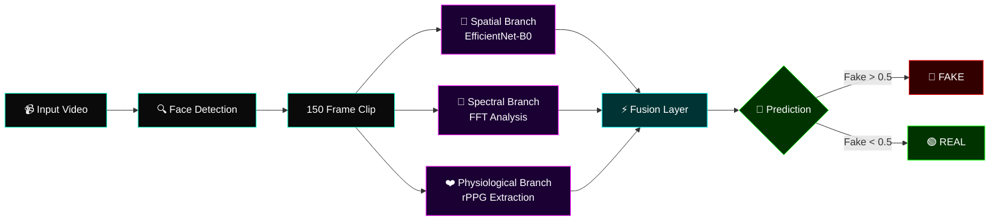

---
title: Deepfake Detection
sdk: docker
app_port: 7860
pinned: false
---

<div align="center">


# ⚡ TRIGUARD-DF ⚡

### `>_ ADVANCED DEEPFAKE DETECTION SYSTEM`

**Three-branch AI analysis using Spatial, Spectral & Physiological signals**
**to detect manipulated video content with military-grade precision.**

<br/>

[](https://huggingface.co/spaces/Abhinav23124/Deepfake-Detection)
[](https://github.com/Abhinav1296/Deepfake-Detection)
[](LICENSE)

<br/>


<br/>

```
╔══════════════════════════════════════════════════════════════╗
║  [ SPATIAL ]  +  [ SPECTRAL ]  +  [ PHYSIOLOGICAL ]  →  🎯  ║
║   EfficientNet     FFT Analysis      rPPG Signals            ║
╚══════════════════════════════════════════════════════════════╝
```

</div>

---

## 🎯 THE MISSION

> Deepfakes are getting scarier. TriGuard-DF fights back with **three independent AI branches** working in parallel — analyzing what you see, what's hidden in frequency space, and even the invisible heartbeat pulses in facial skin.
>
> **One video in. Truth out.**

---

## 🖥️ SYSTEM INTERFACE

<div align="center">

### `> BOOT_SEQUENCE.EXE`


<br/>

### `> UPLOAD_MODULE.INIT`


<br/>

### `> ANALYZING_TARGET...`


<br/>

### `> VERDICT_RENDERED [AUTHENTIC ✓]`


<br/>

### `> VERDICT_RENDERED [DEEPFAKE ⚠]`


</div>

---
## ⚡ FEATURES

<table>
<tr>
<td width="50%">

### 🧠 **Multi-Modal Detection**
Three independent AI branches — spatial, spectral, and physiological — cross-verify each other for maximum accuracy.

</td>
<td width="50%">

### 🎨 **Cyberpunk UI**
Custom-built pixel-art interface with real-time probability visualization and neon-glow verdict cards.

</td>
</tr>
<tr>
<td width="50%">

### ⚡ **Real-Time Inference**
Sub-3-second inference on CPU thanks to optimized preprocessing and efficient architecture design.

</td>
<td width="50%">

### 📊 **Transparent Verdicts**
Every prediction shows fake/real probability, confidence, and which of the three branches contributed.

</td>
</tr>
<tr>
<td width="50%">

### 🐳 **Docker-Native**
Fully containerized. One command to deploy anywhere — HF Spaces, Render, AWS, your own server.

</td>
<td width="50%">

### 🔬 **Research-Grade**
Trained on 8,059 clips from 28 unique actors with pair-safe splits to prevent identity leakage.

</td>
</tr>
</table>

---

## 🏗️ ARCHITECTURE



### 🔍 The Three Branches

<table>
<tr>
<th>Branch</th>
<th>Signal</th>
<th>What It Catches</th>
</tr>
<tr>
<td><b>🧠 Spatial</b></td>
<td>EfficientNet-B0 features from 5 face crops (224×224)</td>
<td>Blending artifacts, texture inconsistencies, geometric warping</td>
</tr>
<tr>
<td><b>🌊 Spectral</b></td>
<td>2D FFT magnitude maps (96×96) with Hanning window</td>
<td>Frequency-domain fingerprints left by GAN generators</td>
</tr>
<tr>
<td><b>❤️ Physiological</b></td>
<td>POS rPPG signals from 6 facial ROIs (150 frames)</td>
<td>Missing/inconsistent heartbeat pulses in fake faces</td>
</tr>
</table>

---

## 📊 PERFORMANCE METRICS

<div align="center">

| Metric | Score |
|:---:|:---:|
| 🎯 **Validation AUC** | `0.9202` |
| 📈 **Average Precision** | `0.9528` |
| ⚖️ **F1 Score** | `0.8684` |
| ✅ **Accuracy** | `84.71%` |
| ⚡ **Inference Time (CPU)** | `~2-4s` |

</div>

### 📈 Training Journey

```
Epoch    Train AUC    Val AUC     F1        Notes
─────────────────────────────────────────────────────
   1       0.6730      0.7868    0.6930    Warm-up
   5       0.9764      0.9192    0.8594    Rapid learning
  11       0.9922      0.9202    0.8598    ⭐ BEST MODEL
  15       0.9960      0.9175    0.8664    Fine-tuning
  21       0.9980      0.9147    0.8543    Convergence
```

---

## 📦 DATASET

Trained on the **DeepFakeDetection (DFD)** dataset with rigorous pair-safe splitting:

<div align="center">

| Split | Real | Fake | Total Clips |
|:---:|:---:|:---:|:---:|
| **Train** | 1,113 | 5,826 | 6,939 |
| **Val**   | 262   | 392   | 654   |
| **Test**  | 359   | 107   | 466   |
| **Total** | **1,734** | **6,325** | **8,059** |

</div>

- 🎭 **28 unique actors** — split by identity, not video
- 🔧 **400+ deepfake methods** covered
- 🎬 **3,431 source videos** processed (~9 hours preprocessing on CPU)
- 💾 **5.69 GB** final HDF5 archive
- 🛡️ **Pair-safe splits** — fake videos only enter a split if BOTH target and source actors belong to that split (prevents identity leakage)

---
## 🚀 QUICK START

### `>_ Option 1: Try It Live (Zero Setup)`

Just visit the live deployment:
### **[👉 https://huggingface.co/spaces/Abhinav23124/Deepfake-Detection](https://huggingface.co/spaces/Abhinav23124/Deepfake-Detection)**

### `>_ Option 2: Run with Docker`

```bash
git clone https://github.com/Abhinav1296/Deepfake-Detection.git
cd Deepfake-Detection
docker build -t triguard-df .
docker run -p 7860:7860 triguard-df
```

Then open `http://localhost:7860` in your browser.

### `>_ Option 3: Run Locally (Python)`

```bash
git clone https://github.com/Abhinav1296/Deepfake-Detection.git
cd Deepfake-Detection

python -m venv venv
venv\Scripts\activate

pip install -r requirements.txt
python app.py
```

Open `http://localhost:7860` — that's it.

---

## 🔌 API ENDPOINTS

<table>
<tr><th>Method</th><th>Endpoint</th><th>Purpose</th></tr>
<tr><td><code>GET</code></td><td><code>/</code></td><td>Web UI</td></tr>
<tr><td><code>GET</code></td><td><code>/health</code></td><td>Model readiness check</td></tr>
<tr><td><code>POST</code></td><td><code>/predict</code></td><td>Single video inference</td></tr>
</table>

### Example: Single Video Prediction

```bash
curl -X POST -F "file=@video.mp4" http://localhost:7860/predict
```

Response:
```json
{
  "video": "video.mp4",
  "prediction": "REAL",
  "confidence": 0.98,
  "probability_fake": 0.02,
  "probability_real": 0.98,
  "inference_time_sec": 3.81,
  "device": "cpu"
}
```

---

## 🗂️ PROJECT STRUCTURE

```
DeepFakeDeploy/
├── app.py                    # Flask server (main entry)
├── main.py                   # CLI inference tool
├── Dockerfile                # Docker deployment config
├── requirements.txt          # Python dependencies
│
├── src/                      # Core ML modules
│   ├── architecture.py       # TriGuardNet model
│   ├── inference.py          # Inference engine
│   ├── model_loader.py       # Checkpoint loader
│   └── preprocessing.py      # Video to tensors pipeline
│
├── models/                   # Trained weights
│   ├── triguard_best.pt      # Model checkpoint (232 MB)
│   └── triguard_config.json  # Model hyperparameters
│
├── configs/                  # YAML configs
├── scripts/                  # Training pipeline
│   ├── 00_verify_dataset.py  # Dataset sanity check
│   ├── 01_preprocess.py      # Video to HDF5
│   └── 02_train.py           # Training loop
│
├── templates/                # HTML templates
├── static/                   # CSS, JS, images
└── docs/screenshots/         # UI screenshots
```

---

## 🛠️ TECH STACK

<div align="center">

**Backend**  
`Python 3.10` • `Flask 3.0` • `PyTorch 2.1` • `timm 0.9`

**Computer Vision**  
`OpenCV 4.9` • `MediaPipe 0.10` • `EfficientNet-B0`

**Signal Processing**  
`SciPy 1.12` • `NumPy 1.26` • `Butterworth filters` • `POS rPPG`

**Deployment**  
`Docker` • `Hugging Face Spaces` • `Git LFS`

**Frontend**  
`Vanilla JS` • `Custom CSS` • `Pixel-art design`

</div>

---

## 🧭 ROADMAP

- [x] Multi-modal architecture with 3 branches
- [x] Web UI with cyberpunk aesthetic
- [x] Docker containerization
- [x] Deployed on Hugging Face Spaces
- [x] REAL vs FAKE verdict visualization
- [ ] Per-branch confidence scores in UI
- [ ] Grad-CAM visualization for spatial branch
- [ ] Live webcam detection mode
- [ ] Mobile-responsive layout
- [ ] Multi-face detection support
- [ ] Video segment localization (which frames are fake)

---

## ⚠️ LIMITATIONS

Real talk — this isn't magic:

- 🐢 **CPU-only inference** on free tier is slow for long videos
- 🎯 **Trained on DFD dataset** — may not generalize to unseen deepfake methods
- 👤 **Single face only** — multi-face videos use the first detected face
- 📏 **Requires 150+ frames** for reliable rPPG extraction (~6.25s at 24fps)
- 🌐 **Free tier upload limit**: 100 MB per video

---

## 👨‍💻 AUTHOR

<div align="center">

### **Abhinav**

`>_ Building AI systems that don't suck.`

[](https://abhinav2312.vercel.app/)
[](https://www.linkedin.com/in/abhinav1296/)
[](https://github.com/Abhinav1296)
[](mailto:abhi.pandu1296@gmail.com)
[](https://huggingface.co/Abhinav23124)

</div>

---

## 📜 LICENSE

Released under the [MIT License](LICENSE) — free to use, modify, and deploy. Just don't blame me if a robot steals your face. 🤖

---

## 🙏 ACKNOWLEDGMENTS

- **Google's DFD Dataset** for providing the raw deepfake corpus
- **Wang et al. (2017)** for the POS rPPG algorithm
- **MediaPipe team** for the face detection wizardry
- **Hugging Face** for the free Spaces hosting
- **Everyone on Stack Overflow** who saved my life at 3 AM

---

<div align="center">

### `>_ SYSTEM STATUS: OPERATIONAL`

**⭐ If this project helped you, drop a star. It costs nothing and makes my day.**

<br/>

```
[END OF README]
[PRESS ANY KEY TO DETECT DEEPFAKES]
```

</div>